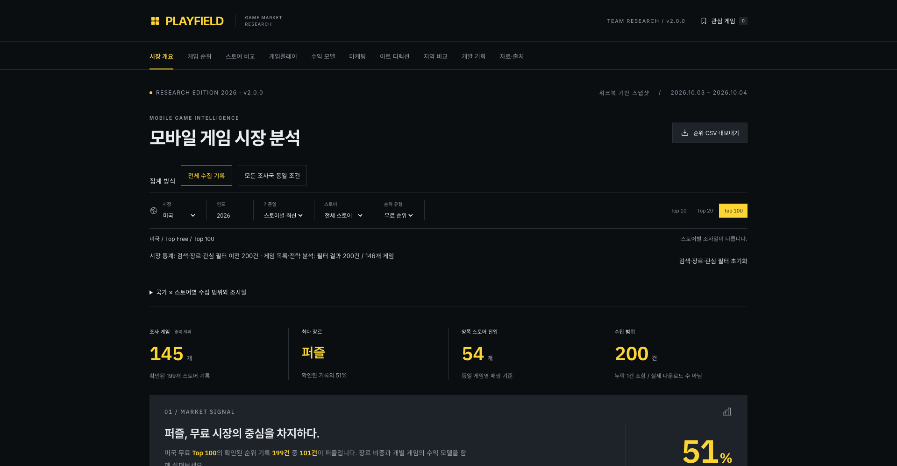
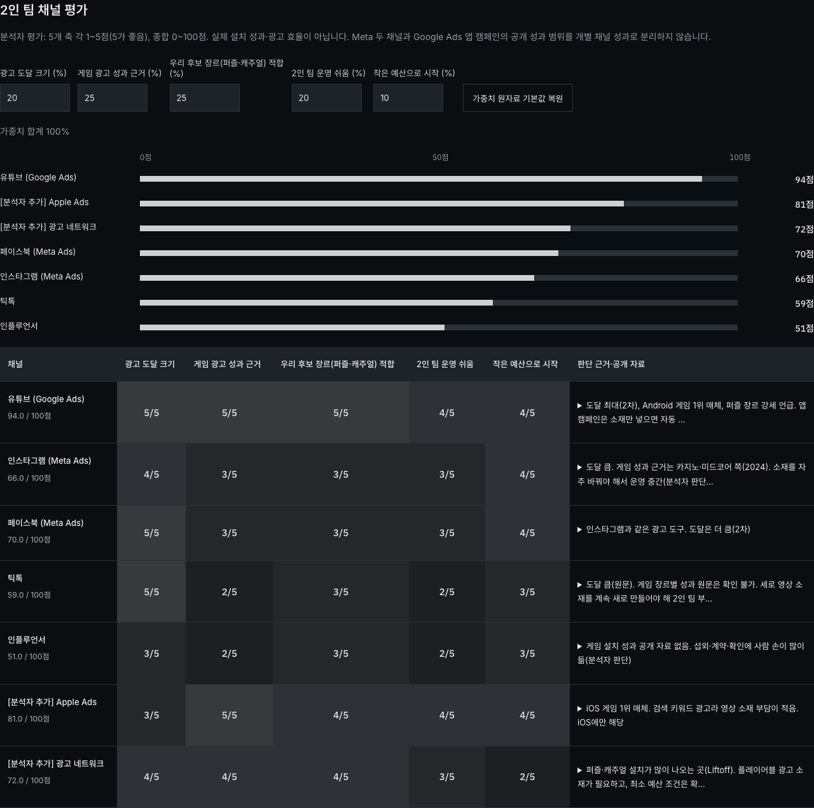
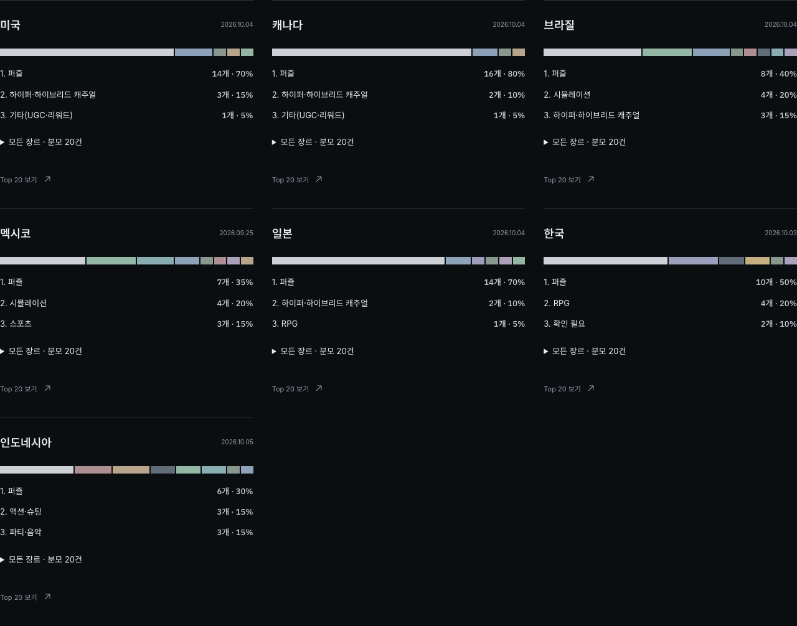

# 최신 원자료 및 16개 개선 구현 결과

검증일: 2026-10-05 미국 태평양 시간. 기준 커밋: `ce85961f4ca0c5b5a1251f8d49de8fe8e44b40cf`.

## 반영한 내용

현재 XLSX를 다시 대조해 안내 문서 이후의 추가 데이터 변경이 없는 것을 확인했다. 전략 워크북은 20→24개 시트, 시장조사는 23개 시트다. 순위와 기존 입력값의 실질적인 변화는 없으며, 수식 캐시의 작은 정밀도 차이를 새 성과로 처리하지 않았다. 원본 XLSX 2개와 사용자의 생성 코드 파일은 수정하거나 실행하지 않았다. 작업 시작 시 기록한 SHA-256과 마지막 파일의 해시를 대조했다.

마케팅에는 7개 채널의 공개 근거·평가 히트맵·가중치 계산, AI 분류와 첫 3초 판독의 별도 표본, 광고 목록과 영상 중복 제거, 단계별 예산·CPI·설치·D7 계산, 소재 A~E와 측정 기준을 추가했다. 지역 비교에는 동남아 해설·벤치마크·OS 페이지뷰 구성과 출시 제안을 연결했다. 개발 기회에는 MVP 후보·전체 평가·입력 부족·검증 목표와 장르/지역 벤치마크를 추가했다.

원래 섹션 순서, 제목·게임명, 어두운 배경·노랑 강조·폰트, 순위 필터·관심 게임·CSV·상세·최대 6개 비교를 유지했다. 추가 라이브러리는 없으며 아이콘은 Phosphor만 사용한다.

## 원자료 대조 결과

| 항목 | 결과 |
| --- | --- |
| 시트 | 47개: 전략 24 + 시장조사 23 |
| 순위 관측 | 420건: 무료 320 + 미국 Google Play 매출 100 |
| 알려진 게임 / 누락 슬롯 | 243개 / 1개 |
| 동일 조건 비교 | 7개국 Google Play 무료 Top 20, 140건 |
| 전략 필드 작성 | 게임플레이·BM·마케팅·아트 각각 23개 / 알려진 게임 243개 |
| 광고 채널 | 7개, 기본 점수 94·66·70·59·51·81·72 |
| AI 후킹 / 형식 | 각각 게임당 25개, 전체 75개; 같은 표본의 별도 분류 표 |
| 영상 목록 / 첫 3초 판독 | 각각 게임당 10건, 전체 30건; 광고 ID로 연결 |
| 서로 다른 영상 | 26개: Royal Match 10, MONOPOLY GO! 7, Magic Sort! 9 |
| 실행안 | 준비 포함 5단계, 소재 5종, 검증 지표 6개 |
| 예산 합계 | $10,000 |
| 예상 설치 합계 | 15,524.92341966025명; 화면 15,525명 |
| 예상 D7 합계 | 563.9167362851576명; 화면 564명 |
| 벤치마크 | 186개: 지역 72 + 동남아 18 + 장르 판독 96 |
| OS 구성 | 원본 19개; 참조본 중복 집계 없음 |
| MVP 평가 | 172개, 점수 빈칸 57개; 추천 후보 7개 |
| 원문 태그 | 루프 분류 8개(추정 포함 1), BM 분류 21개(추정 포함 6) |

독립 대조 스크립트는 순위 420건의 원자료 행, 광고 평가·표본·판독 열, CPI·지역 D7 참조, OS 구성 합계, 벤치마크 값, MVP 점수와 빈칸을 검사한다. 실행안 합계는 `3-4 마케팅 실행안!G13/J13/L13`과 허용오차 `1e-12` 안에서 일치한다. 저장된 Excel 오류 셀은 없다. `2-4 2인 개발 MVP 판단!H39/H51`의 의도적 빈 결과도 구분한다.

## 16개 개선의 구현 위치

| 번호 | 구현 결과 |
| --- | --- |
| 1 | 전체 수집 기록과 모든 조사국 동일 조건의 두 집계 모드·분모 표시 |
| 2 | 시장 통계와 검색·장르·관심 필터 결과 범위, 적용 필터·초기화 |
| 3 | 4개 전략 섹션별 선택 게임·분석 작성·미작성 수 표시 |
| 4 | 공통 순위 축·숫자 라벨·스토어 간 연결 점, ●/□ 구분 |
| 5 | 장르 개수/구성비 전환·공통 눈금·스토어별 분모·누락 슬롯 정의 |
| 6 | 국가별 상위 3개 장르의 개수/비율과 전체 장르 펼침, 고정 팔레트 |
| 7 | 지역 비교 필터를 전체·최신·Google Play·무료·Top 20으로 표시하고 비활성화; CSV도 140건 |
| 8 | 6개 게임의 순위/추정 설치 그래프, 설명 펼침, 고정 헤더·항목, 개별 해제 |
| 9 | 본문 13~14px·보조 글씨 12px, 모바일 조작 확대, 핵심 합계의 노랑 강조 |
| 10 | 범위 밖·미관측·미수집·분석 미작성·해당 없음·의도적 빈 수식 결과·캐시 미저장 구분 |
| 11 | 원자료 행 자동 이동·강조; 필터·검색·게임·비교·스크롤·로컬 조작·펼친 근거 복원 |
| 12 | 국가×스토어×차트의 수집 Top·기록 수·조사일·근거 요약 |
| 13 | 상세에서 게임별 조사국 진입 수·국가별 순위·날짜 표시 |
| 14 | 퍼블리셔 상위 12개의 중복 제외 게임 수/기록 수 전환, 원문 표기 매핑 공개 |
| 15 | 원문 키워드 기반 루프·BM 태그, 추정 여부·표본·미분류 수·근거 펼침 |
| 16 | 지역/동남아/장르 벤치마크·P50/P90/P99 조작과 반복 관측 수입 방식. 성장 그래프는 자료 부족으로 제외 |

반복 관측의 저장·최신 선택은 구현했지만 현재 자료로 계산할 수 없는 성장 추이는 완료 기능으로 보고하지 않는다. 수입 방식과 업데이트 절차는 [DATA_IMPORT.md](DATA_IMPORT.md)에 있다.

## 검증

- `npm run data:import`, `npm run data:verify`, `npm run typecheck` 통과.
- `npm run build`의 일반 프로덕션 빌드와 Pages 정적 빌드 통과. 실행 중인 기존 서버와 분리하기 위해 일반 출력 `.next-verify`, 최종 정적 출력 `.next-pages`를 사용했다.
- Playwright 총 24개 통과: 기존 동작 13개와 신규 데이터·계산·집계·근거·상태 복원·반응형 11개. 일반 프로덕션 및 `/mobile-game-market-research/` 정적 경로에서 실행했다.
- 실제 Codex 브라우저에서 1920×1080, 1440×1000, 834×1000, 390×844를 직접 확인했다. 추가 자동 검증은 각 너비×1000에서 실행했다.
- 모든 섹션, 필터, 관심 게임, 6개 비교, 게임별 해제, 원자료 행 이동·반환, 가중치 오류·복원, 예산 조정, 광고 표본 전환·중복 제거, 지역 라벨, 벤치마크·OS 조작을 확인했다.
- 페이지 전체의 가로 넘침은 없고, 넓은 표와 순위 연결 그래프는 해당 영역 안에서 가로 스크롤한다. 콘솔 오류와 로컬 자산 400번대 이상 응답은 없었다.
- 초기화 전 입력 누락과 OS 범위 복원 후 근거 접힘을 수정하고 테스트했다. 모바일 실행안의 설치·D7 열 너비를 확보해 숫자가 중간에서 끊기지 않게 했다.

이 보고서는 v2 구현의 로컬 검증 결과다. 공개 배포 상태와 버전 기록은 [GitHub Actions](https://github.com/JinCoy/mobile-game-market-research/actions)와 [v2.0.0 릴리스](https://github.com/JinCoy/mobile-game-market-research/releases/tag/v2.0.0)에서 확인한다.

## 자료 한계와 해석

채널 점수는 분석자 평가다. 채널별 실제 CPI·ROAS·전환율과 광고 효과의 인과관계는 미수집이다. 실행안은 가정 계산이며 여러 단계의 합계를 동일 날짜 코호트나 실제 캠페인 성과로 해석하지 않는다. AdWhispr 광고비는 방법·기간이 확인되지 않은 추정값이다.

MONOPOLY GO!의 브랜드 현황 203일과 광고 목록 204일은 각각 원문 범위대로 유지했다. AI 분류 25개와 처음 3초 판독 10개, 목록 30건과 영상 26개를 섞지 않는다. 새 광고 근거는 조사된 3개 게임에만 연결한다.

동남아 순위는 인도네시아만 수집했다. 태국·베트남·필리핀·말레이시아 순위는 미수집이다. 아시아/아시아태평양 참고값을 동남아 개별 국가 실측으로 표시하지 않는다. OS는 StatCounter 페이지뷰 기준으로, 기기 대수·게임 이용자·게임 매출 비율과 다르다. 오세아니아 관측 월은 2026-08, 나머지는 2026-09다.

2026 보고서의 2025 지역 자료와 2025 보고서의 2024 동남아/장르 자료는 따로 표시했다. 장르 값은 차트 판독과 월별 중앙값 평균이며, D28과 D30도 별도 지표다. MVP의 수익 참고값은 D90 ARPU/ARPPU이고 ARPDAU·게임별 실제 측정값은 미수집이다.

## 대표 화면

모바일 화면은 [지역 차트 390px](validation/screenshots/region-charts-390.png)에서 확인할 수 있다. 수치 대조 결과는 [data-checks.json](validation/data-checks.json), 원본 해시는 [source-sha256.json](validation/source-sha256.json)에 저장했다.
